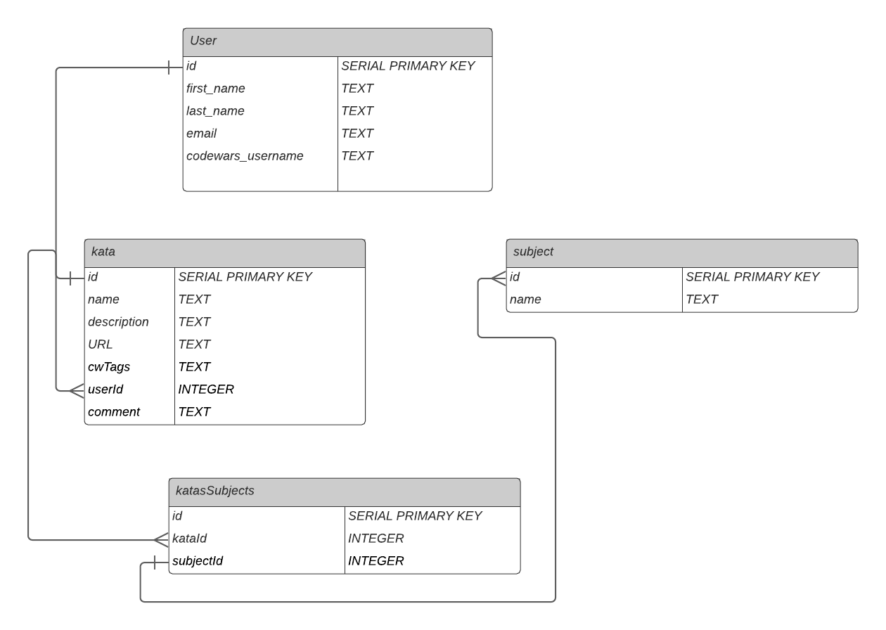

# Proposal

Requirements for the weekend

`1` An application name / concept
Coding Companion

Codewars is a great resource for practicing different coding languages and strategies, but I often forget approaches I've used in the past to solve problems and have to dig through all my unorganized katas to find what I want. My app will let me tag these katas by subject, so that I can access them more easily.

`2` A repo for your project 2 (built from express_auth template)
https://github.com/davemolk/project2

`3` Wireframe for your app - (Lucidchart)

`4` An ERD with two models (minimum) > User + 1 Resource (one to many) - (Lucidchart)

`5` Create (3-5) User Stories for the base user experience - ( [Reference](https://revelry.co/resources/development/user-stories-that-dont-suck/) )

Overview:
As a user, I want to tag my codewars katas with a subject. For instance, I would like to group together all katas that focus on arrays.

As a user, I want to tag a single kata with multiple subjects.

As a user, I want to select a subject and see all katas associated with that subject.

`6` Resource's Restful Routing table ( [Readme](https://romebell.gitbook.io/sei-412/node-express/00readme-1/01intro-to-express/00readme#restful-routing) )

#### /, sign up or log in

#### /subjects, homepage with all the subjects

#### /subjects/:id, info on specific subject

#### /katas, lists all katas

#### /katas/new, form to enter a new kata

#### /katas/:id, info on specific kata

`7` Find API and test to see if you can get data ( _be able to print data in the console using Axios, Node-Fetch, and/or Postman_ )
https://dev.codewars.com/#code-challenges-api
https://www.codewars.com/users/leaderboard
https://stackoverflow.com/questions/43015390/codewars-api-unauthorised

tested with Axios and am able to get data back

'8' stretch goals
Toggle between languages
input multiple tags at once (comma separated list)
ability to add additional resources (both write in and as links)
add other codewars-like sites
can I access other solutions to a kata?
pull from leaderboard and pull katas according to CW tag
